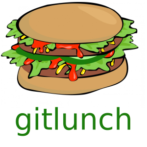

# gitlunch
A friend mentioned getting lunch, but written as git commands. Here's a slightly OTT implementation. 

## Background

If you had to put it on a t-shirt you'd probably write

```
git checkout tummy && git merge lunch
```

There is a lot of implied context here, and quite frankly, it doesn't make for a perfect analogy. But since it's a *nix joke, let's go OTT and see what happens. A key question is, which branch do you checkout and which branch do you merge? Can you swap them?  Since the branch you merge tends to get deleted, and we want to live beyond our lunch, it seems most appropriate to checkout tummy, merge lunch, then delete the lunch branch. This is done in the script `gitlunch.sh` (with some additional frivolity).

## Requirements

You'll need 

   - bash
   - git
  
This was test run on Ubuntu 18.04.

## Usage

```
git clone git@github.com:timdrysdale/gitlunch.git
cd gitlunch
./gitlunch.sh
```

If you want to run it again, then do this first to clean up:

```
./respawn.sh
```

## Result

When run on a bash system you get this:

```
creating human...

Initialised empty Git repository in /home/tim/sources/gitlunch/human/.git/
Switched to a new branch 'tummy'
[tummy (root-commit) 3f6fa17] Add tummy
 1 file changed, 0 insertions(+), 0 deletions(-)
 create mode 100644 tummy/hungry.md

.
├── gitlunch.sh
├── gitlunch.sh~
├── human
│   └── tummy
│       └── hungry.md
├── LICENSE
├── README.md
├── respawn.sh
└── respawn.sh~

2 directories, 7 files

now let's eat lunch

Switched to a new branch 'lunch'
[lunch 33839d5] Add burger to lunch
 2 files changed, 7 insertions(+)
 create mode 100644 tummy/burger.md
 delete mode 100644 tummy/hungry.md
Switched to branch 'tummy'
Removing tummy/hungry.md
Merge made by the 'recursive' strategy.
 tummy/burger.md | 7 +++++++
 tummy/hungry.md | 0
 2 files changed, 7 insertions(+)
 create mode 100644 tummy/burger.md
 delete mode 100644 tummy/hungry.md
Deleted branch lunch (was 33839d5).

.
├── gitlunch.sh
├── gitlunch.sh~
├── human
│   └── tummy
│       └── burger.md
├── LICENSE
├── README.md
├── respawn.sh
└── respawn.sh~

2 directories, 7 files

I'm currently full of...
tomatoes
beef
bun
mustard
cheese
bacon
lettuce
```

## Contributing

If you've found additional layers of pedantry, frivolity or humour then fire me over a PR. Just `respawn.sh` first to remove the `human` folder so there are no issues with `git` sub-modules.

